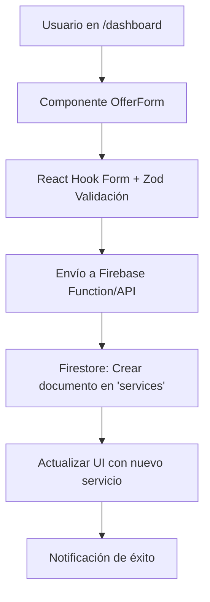

# Arquitectura de Software de Chambit PWA

## Introducción
Chambit sigue una arquitectura desacoplada, separando el frontend (Next.js) del backend (Firebase). Esto permite escalabilidad, mantenibilidad y desarrollo independiente. El frontend maneja la UI/UX, mientras Firebase gestiona autenticación, base de datos y almacenamiento.

## Arquitectura del Frontend

### Framework
- **Next.js con App Router:** Elegido por su SSR/SSG para mejor SEO y performance. El App Router permite rutas anidadas y layouts compartidos, facilitando la organización de páginas como `/dashboard` y `/auth/*`.
- **TypeScript:** Asegura type safety, reduciendo errores en runtime y mejorando la DX con autocompletado.

### Estructura de Componentes
- **Organización Atómica:** Componentes se dividen en átomos (botones), moléculas (formularios) y organismos (dashboards). Ejemplos:
  - `/components/ui`: Componentes base (Button, Card) usando Radix UI.
  - `/components/auth`: Formularios de login/register.
  - `/components/services`: ServiceCard, ServiceList para búsqueda.
- **Reutilización:** Componentes como `ServiceBrowser` combinan múltiples subcomponentes para funcionalidad compleja.

### Gestión de Estado
- **React Context API:** Usado para estado global como autenticación (`AuthProvider`) y perfil de usuario. Justificado por simplicidad para un MVP; para apps más grandes, considerar Zustand o Redux.
- **Estado Local:** useState para componentes individuales (ej. filtros en `ServiceBrowser`).

## Arquitectura del Backend (Firebase)

### Servicios Utilizados
- **Firebase Authentication:** Maneja registro/login con email/contraseña y Google. Proporciona tokens seguros para acceso a otros servicios.
- **Firestore:** Base de datos NoSQL para datos en tiempo real. Usado para perfiles, servicios y solicitudes.
- **Cloud Storage:** Para subir imágenes de perfiles/servicios (futuro).

### Modelo de Datos de Firestore
Esquema diseñado para optimizar lecturas y escalabilidad:

- **Colección `users` (Unificada):** Documentos con campos como `name`, `email`, `role` ('client' o 'expert'), `avatarUrl`. Unificada para evitar duplicación; expertos extienden con campos adicionales.
- **Colección `services` (Primer Nivel):** Documentos con `title`, `description`, `category`, `price`, `expertId` (referencia a `users`). Separada para búsquedas eficientes.
- **Colección `requests` (Primer Nivel):** Documentos con `serviceId`, `clientId`, `expertId`, `status` ('pending', 'accepted', etc.), `offeredPrice`. Denormalizada para lecturas rápidas en dashboards.

Decisiones de Diseño:
- Colecciones de primer nivel evitan joins complejos.
- Denormalización (ej. almacenar `expertName` en `services`) reduce consultas para UI.

## Flujo de Datos
Diagrama simplificado de un flujo CRUD (ej. crear un servicio):

Este flujo muestra cómo los datos van desde la UI, pasan validación, se envían a Firebase y actualizan el estado.